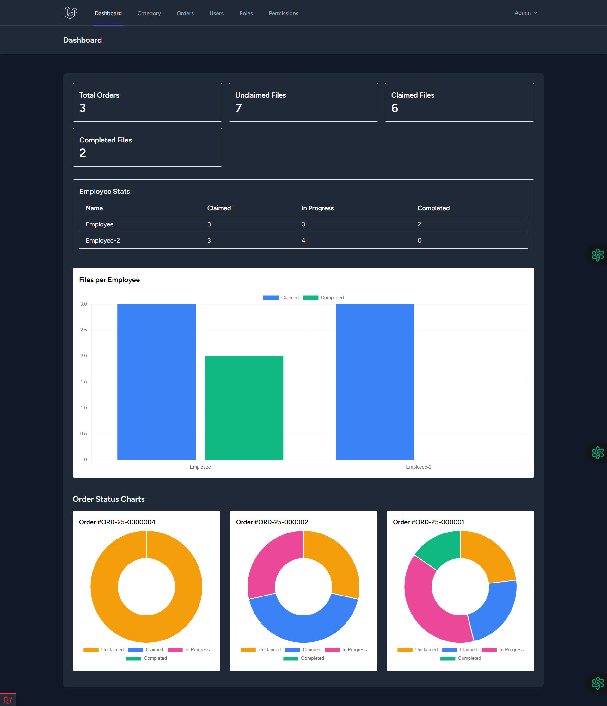
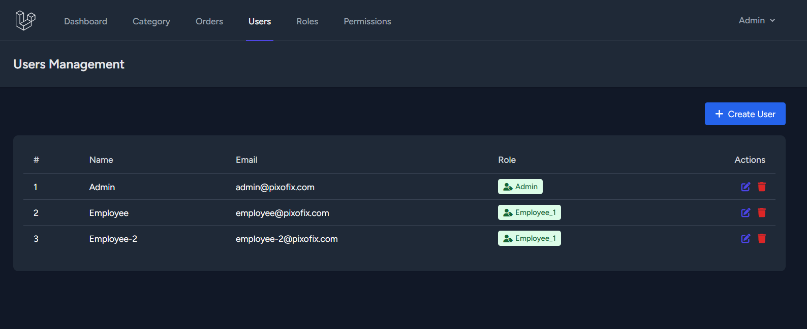
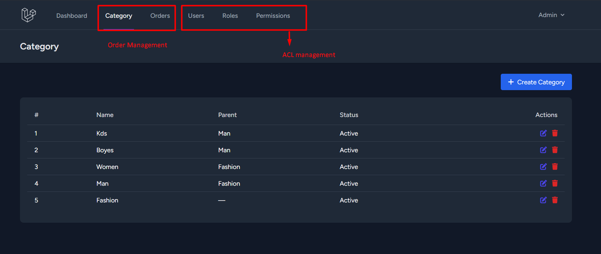
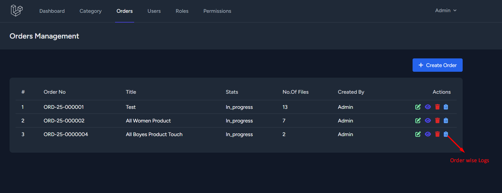
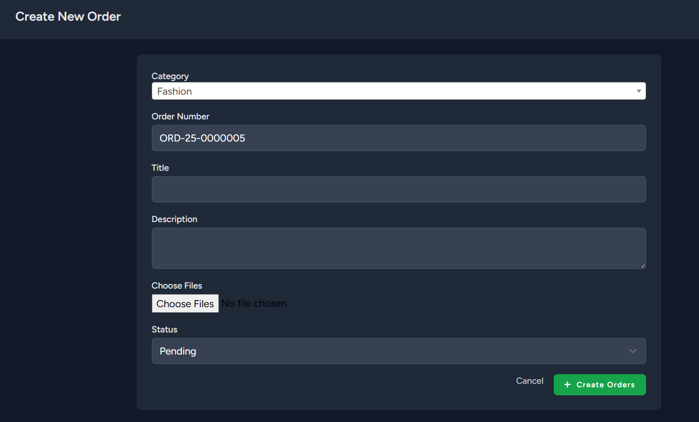
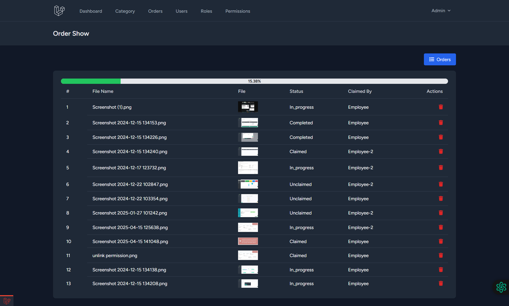
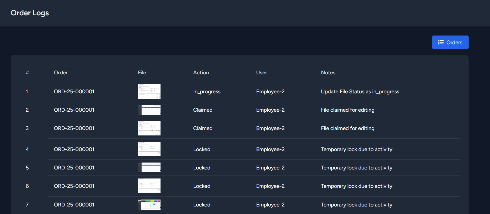
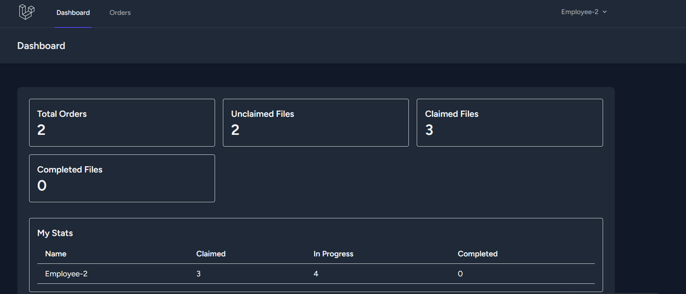
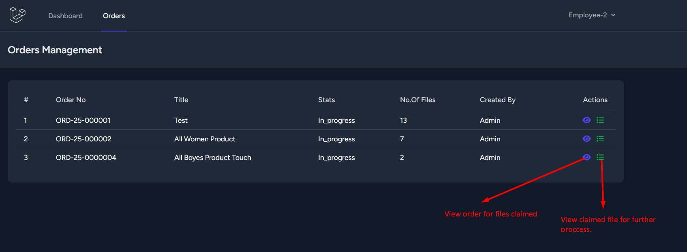
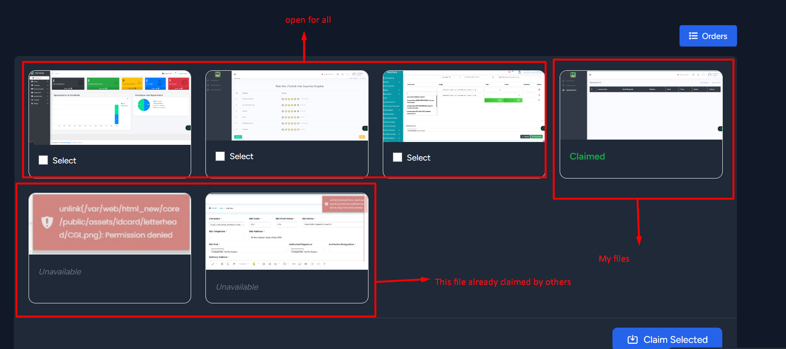

# 📸 Pixofix - Laravel Developer Evaluation Assignment

This Laravel-based web application is built to manage production orders containing hundreds of image files. It enables
employees to claim and work on batches of files with real-time tracking and ensures that no duplication of work occurs.

## 🚀 Features

- 🔒 User Authentication & Role-based Access (Admin, Employee)
- 📁 Structured Order Creation with Folder/File Management
- 📦 Claim-based Task Assignment (10–20 files at a time)
- 🔄 Real-Time Progress Tracking (via WebSockets)
- 📊 Admin Dashboard for Monitoring Orders & Employees
- 📝 Live Logs of File Actions (Claimed, Edited, Completed)
- ✨ (Optional) Photoshop/Illustrator Integration
- 🤖 (Bonus - Optional) AI-based Image Quality Check

## 🛠️ Tech Stack

- **Framework**: Laravel 10.10
- **Database**: MySQL
- **Frontend**: Blade (Breeze), Alpine.js, Tailwind CSS
- **Real-time**: Laravel Echo + Pusher
- **Version Control**: GitHub
- **PHP**: 8.1
- **Local Server**: laragon/xampp

## ⚙️ Installation Instructions

1. **Clone the Repository**
   ```bash
   git clone https://github.com/farookhridoy/pixofix-photo-editor-tracker.git
   cd pixofix-photo-editor-tracker
   ```

2. **Install Dependencies**
   ```bash
   composer install
   npm install && npm run dev
   ```

3. **Environment Configuration**
   ```bash
   cp .env.example .env
   php artisan key:generate
   ```

   Update `.env` file with your database and broadcasting credentials (for real-time support).

4. **Run Migrations & Seeders**
   ```bash
   php artisan migrate --seed
   ```

5. **Run the Server**
   ```bash
   php artisan serve
   php artisan schedule:work //for runing unlocked file
   ```

6. **Setup WebSockets**
    - Create an account in pusher
    - Update `.env` with `BROADCAST_DRIVER=pusher` and related keys.

## 🧪 Dummy Credentials for Testing

- **Admin**
    - Email: `admin@pixofix.com`
    - Password: `password`

- **Employee**
    - Email: `employee@pixofix.com`
    - Password: `password`

## 📁 Project Structure Highlights

- `app/Http/Controllers` – Role-based CRUD and Order Management
- `resources/views` – Blade templates for Auth, Dashboard, File Management
- `routes/web.php` – Route definitions
- `database/seeders` – Roles, Permissions, Dummy Users
- `app/Console/Commands` – Scheduler Command
- `app/Events` – FileLocked, Unlocked Events
- `app/Jobs` – Bulk file upload job
- `resources/js/bootstrap.js` – Pusher setup and functionality

## 📌 Future Enhancements

- Multiple image uploads
- Using file lock for 2 min after that automatically unlocked the file
- Realtime progress
- Interactive Dashboard
- Realtime employee activity tracking

## ✅ Contribution & Evaluation Checklist

- [x] Authentication & Role Management
- [x] Order & File Upload Interface
- [x] File Claiming Logic
- [x] Real-Time Tracking
- [x] Admin Dashboard
- [x] User Management
- [x] Role Management
- [x] Permission Management
- [ ] Optional: Photoshop/Illustrator Integration
- [ ] Optional: AI Error Detection

### 📸 UI Screenshots

#### 📜 Admin Dashboard

An overview dashboard for admin showing order-related metrics such as total, completed, employee wise chart, order wise
chart, and ongoing orders.



#### 📜 User & ACL Management

This interface allows admins to manage users, roles, permissions. You can add, edit, or delete these from a centralized
panel.



#### 📜 Category Management

This interface allows admins to manage categories. You can add, edit, or delete categories from a centralized panel.



#### 📜 Order Management

This interface allows admins to manage orders. You can add, edit, or delete orders from a centralized panel.




#### Realtime order state show



#### Order Wise File Logs



#### 📜 Employee Dashboard

An overview dashboard for employees showing order-related metrics such as total, completed, and ongoing orders.



#### 📜 Employee Order Management

This interface allows employee to manage orders. You can update status of a claimed file, do batch wise claimed, locked
file from this centralized panel.



#### Order Wise File Page



## 📄 License

This project is licensed under the MIT License.
